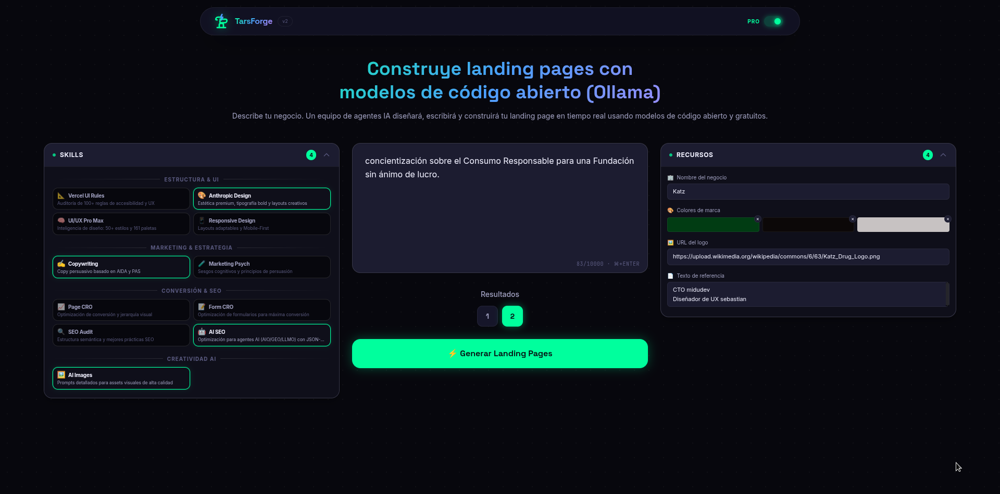
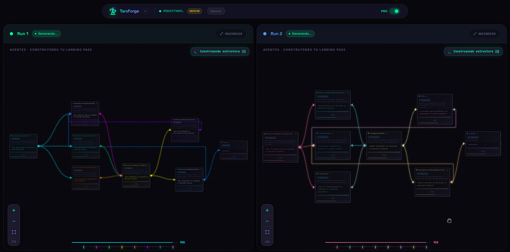
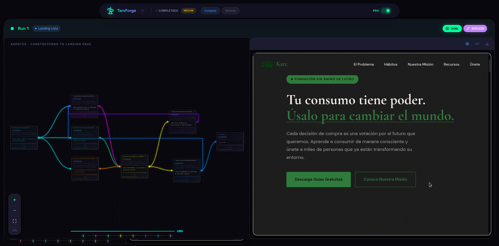
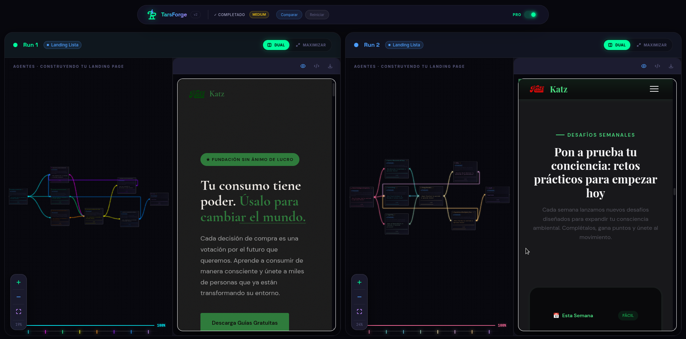
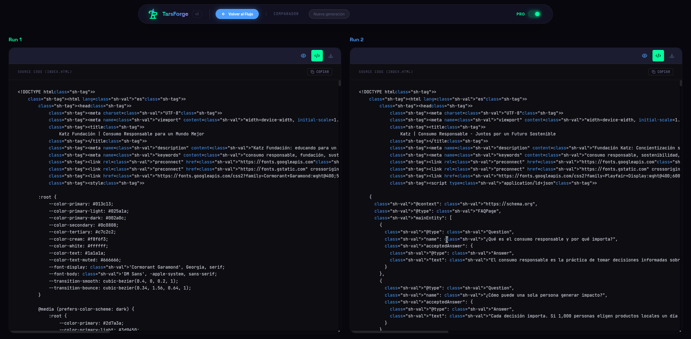
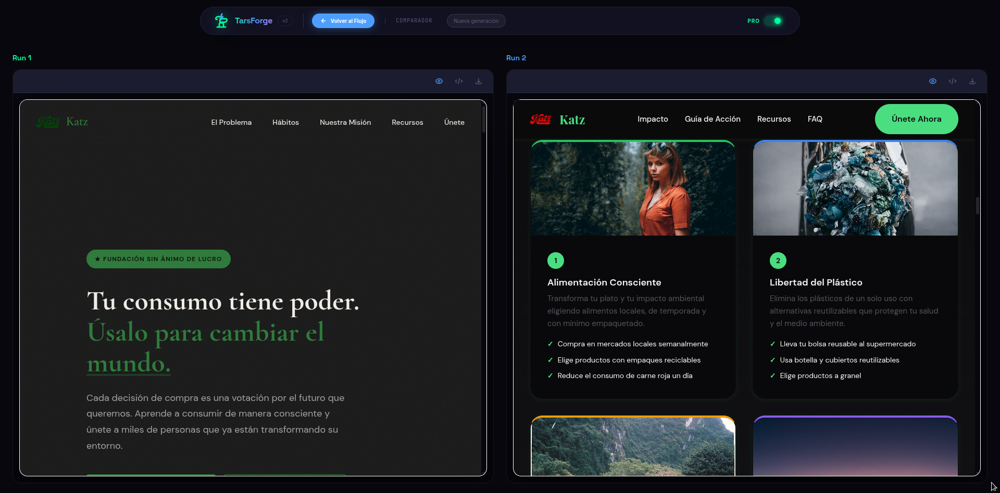

# 🤖 TarsForge — Landing Pages con IA Multi-Agente

> **Describe tu negocio. Un equipo de agentes IA genera tu landing page en tiempo real.** TarsForge orquesta múltiples agentes especializados — creados dinámicamente por IA según tu proyecto — para diseñar, escribir y construir landing pages profesionales.

[](https://vps23087.cubepath.net/)
[](https://react.dev/)
[](https://vitejs.dev/)
[](https://tailwindcss.com/)

---

## ✨ ¿Qué es TarsForge?

TarsForge es una **plataforma de generación de landing pages impulsada por inteligencia artificial** que orquesta múltiples agentes especializados en un flujo visual interactivo. A diferencia de herramientas tradicionales que generan código genérico, TarsForge utiliza un **sistema multi-agente dinámico** donde la IA decide automáticamente qué roles y especialistas necesita según tu proyecto — desde arquitectos de información hasta expertos en SEO y conversión.

### 🔥 ¿Qué problema resuelve?

| Problema | Solución TarsForge |
|---|---|
| Crear landing pages requiere diseño, copy y código | Un solo prompt genera todo automáticamente |
| Los generadores IA dan resultados genéricos | Agentes dinámicos + skills de diseño seleccionables |
| No hay forma de comparar versiones | Comparador side-by-side con múltiples variaciones |
| Dependencia de APIs costosas | Impulsado por **Ollama Cloud** — modelos open-source con límites generosos por token |

---

## 📸 Capturas de Pantalla

### 🏠 Página Principal
Interfaz glassmorphism con estética neón. Describe tu proyecto y selecciona las skills que deseas potenciar.



### ⚡ Orquestación en Tiempo Real
Visualiza el flujo de agentes en acción con el grafo interactivo. Cada agente muestra su estado, progreso y output en tiempo real.



### 🖥️ Previews en Vivo
Mientras los agentes trabajan, obtén previews parciales del HTML generado con diseño responsive.




### 🔀 Comparador de Versiones
Compara múltiples versiones generadas lado a lado — tanto el resultado visual como el código fuente.





---

## 🧠 Arquitectura de Agentes Dinámicos

TarsForge no usa un conjunto fijo de agentes. **La IA analiza tu prompt y decide automáticamente qué roles necesita** para tu proyecto específico. Dependiendo de lo que describas, el orquestador puede crear agentes especializados en arquitectura, diseño visual, copywriting, SEO, conversión, traducción y más — cada flujo de orquestación es único.

### 🎯 Skills de Diseño

Selecciona las habilidades que quieres potenciar antes de generar:

- **Estructura & UI** — Reglas de accesibilidad, diseño premium, responsive
- **Marketing & Estrategia** — Copywriting persuasivo, psicología del marketing
- **Conversión & SEO** — CRO, auditoría SEO, optimización para agentes AI
- **Creatividad AI** — Generación de imágenes con IA

---

## 🖥️ Uso de CubePath

> **Este proyecto fue desplegado en CubePath aprovechando los créditos proporcionados durante la Hackatón 2026.**

### ¿Cómo se utilizó CubePath?

1. **Provisionamiento de VPS** — Se obtuvo un servidor virtual dedicado (VPS) a través de la plataforma CubePath, utilizando los créditos de la hackatón.

2. **Configuración de Ollama Cloud** — Gracias al acceso root del VPS proporcionado por CubePath, se instaló y configuró **Ollama** directamente en el servidor, permitiendo ejecutar modelos de IA de código abierto en la nube sin depender de APIs externas de pago.

3. **Despliegue de la Aplicación** — El build de producción de TarsForge (React + Vite) se desplegó en el mismo VPS, sirviendo la aplicación de forma autónoma.

4. **Beneficios clave**:
   - ✅ **Sin costos de infraestructura** — Los créditos de CubePath cubrieron el hosting completo
   - ✅ **Control total** — Acceso root para instalar Ollama y configurar el entorno
   - ✅ **Modelos cloud open-source** — Ejecución de IA con límites generosos de API
   - ✅ **Demo en vivo 24/7** — Los jueces pueden probar la app en cualquier momento

---

## 🚀 Instalación Local

### Requisitos Previos

- **Node.js** >= 18.x
- **npm** >= 9.x

### Pasos

```bash
# 1. Clonar el repositorio
git clone https://github.com/SebastianMoralesDuque/Tarsforge
cd Tarsforge

# 2. Instalar dependencias
npm install

# 3. Iniciar servidor de desarrollo
npm run dev
```

La aplicación estará disponible en `http://localhost:5173`.

### Scripts Disponibles

| Comando | Descripción |
|---|---|
| `npm run dev` | Inicia servidor de desarrollo con HMR |
| `npm run build` | Build de producción optimizado |
| `npm run preview` | Previsualiza el build de producción |
| `npm run lint` | Ejecuta ESLint sobre todo el código |

---

## 🛠️ Tech Stack

| Categoría | Tecnología |
|---|---|
| **Framework** | React 19 |
| **Build Tool** | Vite 8 |
| **Estilos** | Tailwind CSS 4 + CSS Custom Properties |
| **Grafo Visual** | @xyflow/react |
| **Linting** | ESLint 9 |
| **IA** | Ollama Cloud (modelos open-source) |
| **Hosting** | VPS vía CubePath |

---

## 📂 Estructura del Proyecto

```
src/
├── atoms/            # Componentes UI base
├── molecules/        # Componentes compuestos
├── organisms/        # Secciones complejas (AgentGraph, WorkspacePanel, PreviewFrame)
├── pages/            # Rutas (Setup, Config, Run, Compare)
├── context/          # Estado global
├── hooks/            # Hooks custom (useOrchestrator, useGeminiAPI)
├── utils/            # Utilidades
├── constants/        # Datos estáticos
└── data/             # Librería de skills
```

---

## 🎯 Criterios Destacados

### 🎨 Experiencia de Usuario (UX)

- **Flujo intuitivo de 4 pasos**: Setup → Config → Run → Compare
- **Feedback visual en tiempo real**: Estados de agentes con animaciones y colores neón
- **Comparador visual**: Side-by-side con vista de código y preview simultáneos
- **Modo demo sin registro**: Prueba la app sin necesidad de crear cuenta
- **UI glassmorphism premium**: Estética moderna con variables CSS custom

### 💡 Creatividad

- **Agentes dinámicos**: La IA decide qué roles necesita según tu proyecto — no hay dos orquestaciones iguales
- **Generación paralela**: Múltiples versiones simultáneas para comparar enfoques distintos
- **Skills seleccionables**: Personalización granular del resultado final
- **IA 100% open-source**: Sin dependencia de APIs propietarias — Ollama Cloud en tu propio servidor
- **Grafo interactivo**: Visualización en vivo de la orquestación multi-agente

---

## 🏆 Hackatón CubePath 2026

> **Proyecto desarrollado para la Hackatón CubePath 2026**
>
> Demo en vivo: [https://vps23087.cubepath.net/](https://vps23087.cubepath.net/)

---

## 📝 Licencia

MIT — Código abierto. Úsalo, modifícalo, mejóralo.
